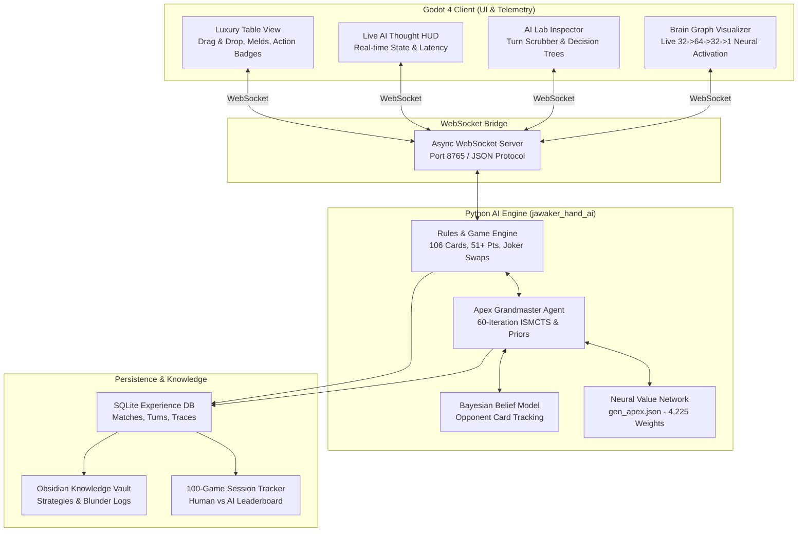

# 🎴 Jawaker Hand AI Grandmaster

[](https://www.python.org/downloads/)
[](https://godotengine.org/)
[](https://pytest.org)
[](https://github.com/)
[](https://opensource.org/licenses/MIT)

> **A Superhuman, Deep Reinforcement Learning & Information Set Monte Carlo Tree Search (ISMCTS) AI Engine paired with a Luxury Godot 4 Client for Jawaker Hand Rummy.**

---

## 🌟 Overview

**Jawaker Hand AI** is an advanced, production-grade artificial intelligence engine designed specifically for the popular card game **Jawaker Hand Rummy**. Built with rigorous adherence to official tournament rules, it combines:

1. **Apex Grandmaster Engine**: 60-iteration Deep ISMCTS lookahead search coupled with AlphaZero-style heuristic priors, Bayesian card counting, and deadwood synergy matrices.
2. **Deep Neural Value Network**: A 2-hidden layer feed-forward value network (32 inputs -> 64 hidden -> 32 hidden -> 1 output) trained over **10,000+ full self-play games**.
3. **Luxury Godot 4 Client**: Vector card rendering, drag-and-drop mechanics, sound effects, real-time AI thought HUD, and interactive match analytics.
4. **Interactive AI Lab & Brain Graph Visualizer**: A full post-game analysis lab with turn-by-turn scrubber, candidate action evaluation trees, and an animated, real-time **Neural Brain Graph** displaying exact float activations and active synaptic pathways.
5. **Human vs AI 100-Game Tracker**: Built-in competitive session tracker for benchmarking human performance against the Grandmaster AI over multi-match campaigns.
6. **Obsidian Knowledge Vault**: Automated export of match histories, tactical blunders, opponent dossiers, and optimal meld strategies into Obsidian markdown.

---

## 🏗️ System Architecture



---

## 🧠 AI & Neural Network Innovations

### 1. Vectorized Neural Value Network
The neural evaluator extracts a 32-dimensional strategic feature vector representing:
* **Meld & Deadwood Metrics**: Hand penalty sum, melded card ratio, initial meld score, 51+ readiness threshold.
* **Table Context**: Open status, minimum opponent card count, opponent threat level (<= 5 cards warning).
* **Tactical Resources**: Usable attachments, Joker counts, Joker hijack opportunities.
* **Suit & Rank Distributions**: Suit concentration ratios, Aces count, face card weight (K, Q, J).
* **Defensive Danger Index**: Discard attachment hazard to opponent sets, penalty value penalty.
* **Endgame Ambition**: 14-card Hand Finish potential (-60 pt swing).

$$\mathbf{X} \in \mathbb{R}^{32} \xrightarrow{\mathbf{W}_1, \mathbf{b}_1} \text{ReLU}(\mathbf{h}_1 \in \mathbb{R}^{64}) \xrightarrow{\mathbf{W}_2, \mathbf{b}_2} \text{ReLU}(\mathbf{h}_2 \in \mathbb{R}^{32}) \xrightarrow{\mathbf{W}_3, \mathbf{b}_3} \hat{V}(s) \in \mathbb{R}$$

### 2. Information Set MCTS (ISMCTS) with Bayesian Belief
Because card games involve imperfect information, the AI samples unobserved opponent cards from a Bayesian belief distribution conditioned on:
* Discard pile pickups and passes.
* Number of cards remaining in hand.
* Table meld contributions.

In each of the **60 lookahead iterations**, the agent samples a consistent determinization of the world, simulates future turns using UCB1 exploration-exploitation, and evaluates leaf states with the Neural Value Network.

### 3. Hand Synergy & Defensive Blunder Shield
* **Synergy Matrix**: Automatically protects pairs (e.g., `8♦ 8♠`) and suited connectors (e.g., `9♥ 10♥`) from premature discard.
* **Blunder Shield**: Checks all open table melds; if a card can be attached by the opponent, it receives a severe penalty (-1000 pts) preventing dangerous discards.
* **Dead Card Detection**: Identifies cards whose duplicate copies have already appeared on the table or discard pile, marking them 100% safe to burn.

---

## 🎮 Official Tournament Rules Enforced

* **Deck Composition**: 106 cards (2 standard 52-card decks + 2 Jokers).
* **Hand Deal**: 14 cards per player (15 to the first player right of the dealer).
* **Opening Threshold**: Initial meld must sum to **>= 51 points** ($A = 11$ or $1$ in $A-2-3$, $10/J/Q/K = 10$, numbers face value).
* **Discard Reserve Invariant**: Players cannot empty their hand during the meld phase—at least 1 card MUST be reserved to burn to the discard pile to complete the round.
* **Discard Pile Pickup Rule**: Drawing from the discard pile is only permitted if the card immediately enables an opening meld (>= 51 pts) or attaches to an existing meld.
* **Joker Hijacking (`SWAP_JOKER`)**: Players with an open hand can swap matching real cards with Jokers on table melds.
* **Scoring Rules**:
  * **Normal Finish**: Winner gets -30 pts; other players score their remaining deadwood.
  * **Hand Finish**: Winner gets -60 pts; losers get double deadwood (2x) or +200 if unopened!
  * **Unopened Penalty**: +100 pts (+200 on Hand Finish).

---

## 📁 Repository Structure

```text
jawaker-hand-ai/
├── godot_client/
│   ├── scenes/
│   │   ├── Table.tscn                 # Main Table UI & AI Lab Inspector
│   │   ├── Card.tscn                  # Vector playing card scene
│   │   └── TableMeld.tscn             # Table meld container
│   ├── scripts/
│   │   ├── Table.gd                   # Table controller & turn scrubber
│   │   ├── NetworkClient.gd           # WebSocket client
│   │   └── BrainGraphVisualizer.gd    # Real-time neural brain graph
│   └── project.godot                  # Godot 4.x project settings
│
├── jawaker_hand_ai/
│   ├── agents/
│   │   ├── apex_grandmaster_agent.py  # Superhuman Grandmaster Agent
│   │   ├── deep_rl_agent.py           # 32-dim Value Network Agent
│   │   ├── ismcts_agent.py            # Information Set MCTS Agent
│   │   └── heuristic_agent.py         # Rule-based Tactical Agent
│   ├── engine/
│   │   ├── card.py                    # 106-card deck representation
│   │   ├── melds.py                   # Exact 51+ meld optimizer
│   │   ├── state.py                   # Game state & phase machine
│   │   ├── table.py                   # Melds & Joker replacement
│   │   └── rules.py                   # Official scoring & penalties
│   ├── learning/
│   │   ├── network.py                 # Vectorized NeuralValueNetwork
│   │   └── massive_trainer.py         # 10,000-game self-play trainer
│   ├── opponent/
│   │   └── belief.py                  # Bayesian card tracking
│   ├── persistence/
│   │   ├── db.py                      # SQLite experience database
│   │   ├── trace.py                   # Structured DecisionTrace telemetry
│   │   └── session_tracker.py         # 100-Game Challenge Tracker
│   ├── server/
│   │   └── server.py                  # Async WebSocket server for Godot
│   └── cli/
│       └── main.py                    # Unified CLI entry point
│
├── models/
│   └── gen_apex.json                  # Pretrained neural network weights
│
├── obsidian_vault/                    # Strategy notes & match traces
├── tests/                             # 23 unit & integration tests
├── .gitignore                         # Git ignore rules
├── requirements.txt                   # Python dependencies
├── pyproject.toml                     # Package metadata
├── LICENSE                            # MIT License
└── README.md                          # Documentation
```

---

## ⚡ Quickstart Guide

### 1. Prerequisites
* **Python 3.10+** installed.
* **Godot 4.2+ or 4.3** ([Download Godot 4](https://godotengine.org/download)).

### 2. Installation
```bash
# Clone the repository
git clone https://github.com/hamzaalmughrabi/jawaker-hand-ai.git
cd jawaker-hand-ai

# Create virtual environment
python -m venv .venv
source .venv/bin/activate  # On Windows: .venv\Scripts\activate

# Install dependencies
pip install -r requirements.txt
```

### 3. Run the Test Suite
```bash
pytest -v
```
*(All 23 engine, neural network, rule invariant, and server tests will run and pass).*

---

### 4. Play with Godot 4 Client
1. **Start the Python AI WebSocket Server**:
   ```bash
   python -m jawaker_hand_ai.cli.main serve --port 8765
   ```
2. **Launch Godot 4**:
   * Open the Godot 4 Editor.
   * Click **Import** and select `godot_client/project.godot`.
   * Press **F5** (or click **Play**).
   * Play against the Superhuman Grandmaster AI!

---

## 💻 CLI Commands & Tooling

| Command | Description |
| :--- | :--- |
| `python -m jawaker_hand_ai.cli.main serve --port 8765` | Start the WebSocket server for the Godot 4 client. |
| `python -m jawaker_hand_ai.cli.main play --agent apex` | Play an interactive game in the terminal against Apex Grandmaster. |
| `python -m jawaker_hand_ai.cli.main tournament --rounds 10 --players 2` | Run an automated benchmark tournament across all AI agents. |
| `python -m jawaker_hand_ai.cli.main track` | View the **100-Game Human vs AI Challenge** leaderboard. |
| `python -m jawaker_hand_ai.cli.main replay` | Interactive terminal decision inspector and turn replayer. |
| `python -m jawaker_hand_ai.cli.main export-vault --output obsidian_vault` | Export all match traces, blunder logs, and strategies to Obsidian. |
| `python -m jawaker_hand_ai.cli.main massive-train --games 1000` | Run self-play reinforcement learning and update neural weights. |

---

## 📊 100-Game Human vs AI Challenge

Track your win-rate against the AI Grandmaster:
```bash
# View the live leaderboard
python -m jawaker_hand_ai.cli.main track

# Record a completed match
python -m jawaker_hand_ai.cli.main track --record --winner AI --human-score 124 --ai-score -30 --rounds 5 --notes "Round 4 Hand finish"
```

---

## 🔬 Obsidian Knowledge Vault Integration

All AI decisions are indexed and exported into an **Obsidian-compatible Markdown Vault** featuring:
* **Interactive match replay notes**: Linked game states and score progressions.
* **Blunder logs**: Tactical errors automatically detected and categorized.
* **Strategic playbooks**: 51-point opening thresholds, Joker preservation heuristics, and endgame hand finishing patterns.

To open the vault, simply point your **Obsidian App** to the `obsidian_vault/` directory.

---

## 📜 License

This project is licensed under the **MIT License** - see the [LICENSE](LICENSE) file for details.

---

<div align="center">
  <b>Developed with ❤️ for the Hand Rummy & AI Research Community</b>
</div>
