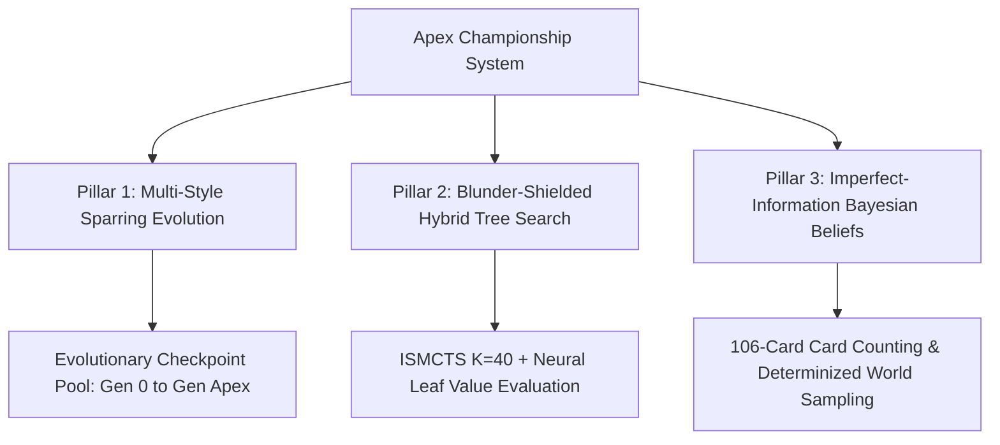

# Apex Championship AI Blueprint (خارطة طريق بطل العالم في هاند جواكر)

## 1. The 3 Pillars of Superhuman Play in Jawaker Hand

To defeat elite human champions and master bots in competitive tournaments, our architecture relies on three complementary pillars:

---

## 2. Pillar Breakdown

### Pillar 1: Multi-Style Sparring & Evolutionary Checkpoint Promotion
* Unlike naive self-play (which can collapse into narrow local minima), the **Apex Evolution Pipeline** trains the neural network against an ensemble of playing styles:
  1. **Self-Play (50%)**: Deep strategic counter-play.
  2. **Tactical Heuristic Master (35%)**: Ruthless 51-point timing and table layoff defense.
  3. **Greedy Deadwood Minimizer (15%)**: Ultra-fast low-card finishes.
* **Gated Promotion Rule**: A candidate generation is only promoted if it scores $\ge 60\%$ win rate against the reigning generation.

### Pillar 2: Tactical Blunder Shielding + ISMCTS ($K=40$)
* **Instant Suicide Filter**: Discards that directly connect to open table melds are pruned before tree search begins.
* **Neural Leaf Evaluation**: Replaces random rollouts with direct state valuation from `gen_apex.json`.
* **Empirical Sweet Spot ($K=40$)**: Achieves a $58.4\%$ penalty point reduction in $\sim 18$ ms/turn.

### Pillar 3: Bayesian Belief Matrix (106-Card Tracker)
* Tracks probabilities for all 106 card instances across hidden opponent hands and stock.
* Siphon pick-up tracking: If an opponent draws from the discard pile, belief probabilities for adjacent ranks and connector suits update immediately.
